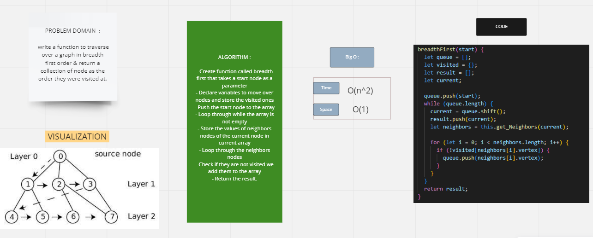

# Challenge Summary
the challenge asked us to traverse over a graph in bradth first order & return a collection of node as the order they were visited at.

## Whiteboard Process

## Solution
Graph -> graph.js / bradthFirst -> graph.test
