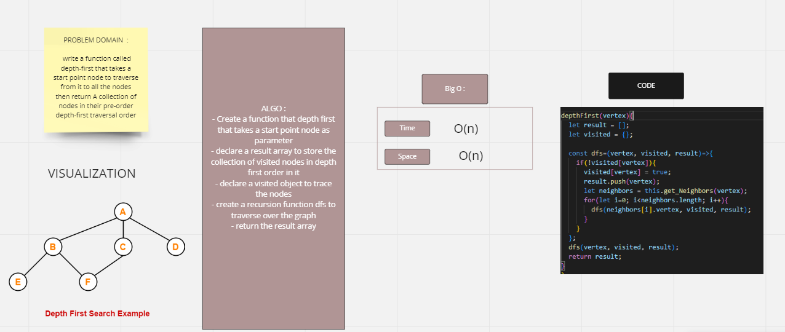

# Depth First Traversal
Depth First Search (DFS) algorithm traverses a graph in a depthward motion and uses a stack to remember to get the next vertex to start a search, when a dead end occurs in any iteration.

## Challenge
the challenge asked us to write a function called depth-first that takes a start point node to traverse from it to all the nodes then return A collection of nodes in their pre-order depth-first traversal order

## Approach & Efficiency
i used the recursion approach because its much efficient than iterative approach when dealing with depth first traverse 
it will ends with O(n) for time & space complexity becaause it depends on how many nodes we are traversing at.

## Solution

