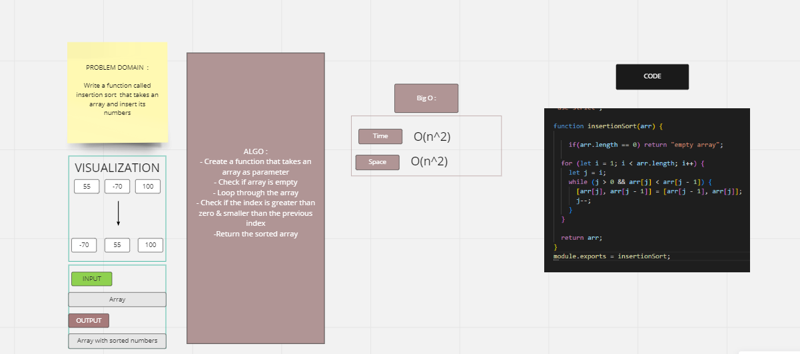
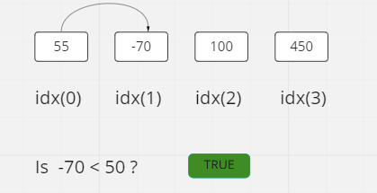
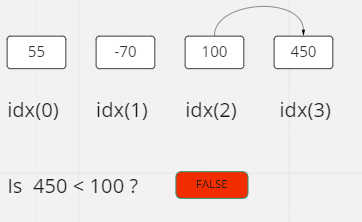

# Challenge Summary
the challenge asked us to read a pseudocode then write the code in our language then write the solutionsteps as a blog

## Whiteboard Process

## Solution
## blog:

      input : 

      [55,-70,100]

      1- check if the array is empty

      2- compare inedx(1) with index(0)
      

      3- compare index(2) with index(1)

4- compare index(#) with index(2) 

5- swap all values based in the smaller to greater

## big(o) :

Time: O(n^2) The basic operation of this algorithm is comparison. This will happen n * (n-1) times.

Space: O(1) No additional space is being created.
       
=======

