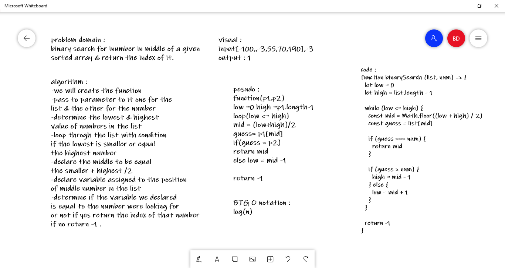

# Binary Search of Sorted Array
having sorted array we want to check for specific number if it is exisit by passin the number to the function search for it if we found it will return the index of its position if not we will return -1 .

## Whiteboard Process

## Approach & Efficiency
<!-- What approach did you take? Discuss Why. What is the Big O space/time for this approach? -->