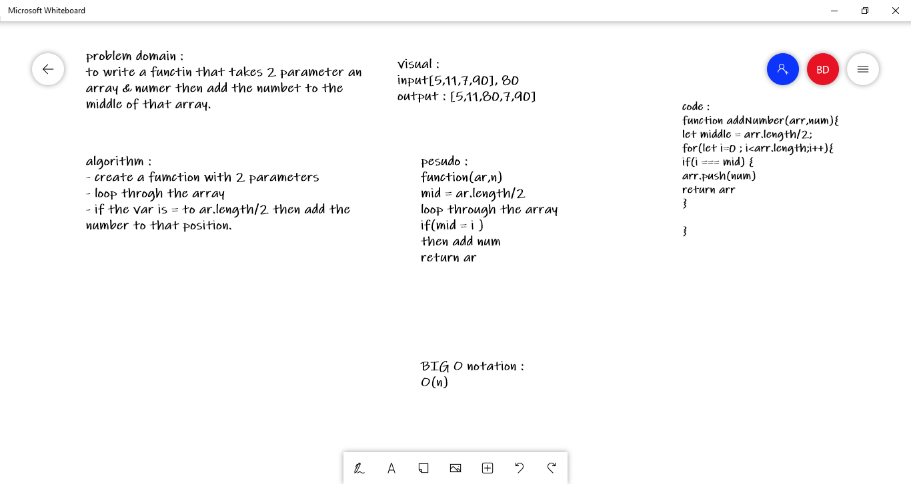

# Insert to Middle of an Array
to write a functin that takes 2 parameter an array & numer then add the numbet to the middle of that array.

## Whiteboard Process

## Approach & Efficiency
<!-- What approach did you take? Discuss Why. What is the Big O space/time for this approach? -->