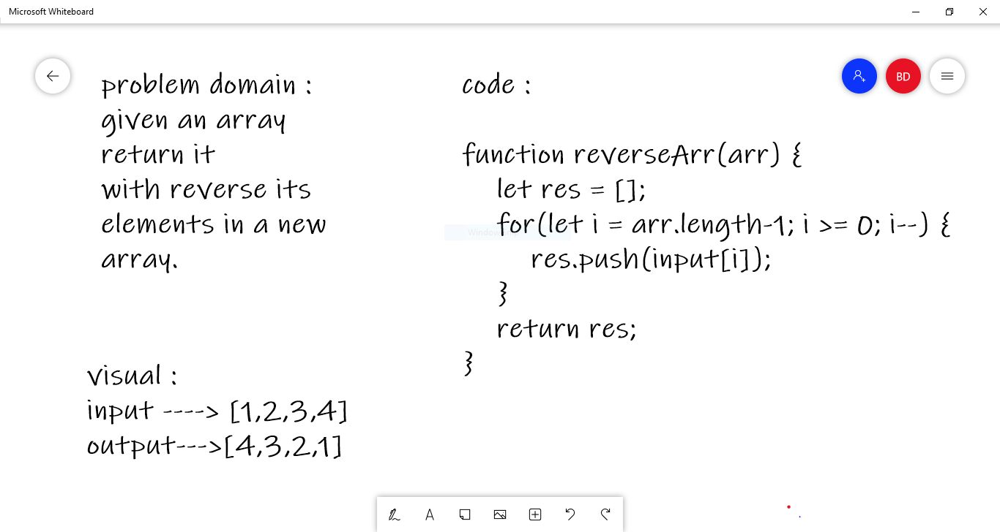

# Reverse an Array

we have to write the algorithm to reversed array code.

## Whiteboard Process

## Approach & Efficiency
<!-- What approach did you take? Discuss Why. What is the Big O space/time for this approach? -->

### Table Of Contents
**********************
|Challenge|Link|
|:-----------|:------------------------------|
|Challenge01|https://github.com/bushraAD98/data-structures-and-algorithms/pull/1|

                