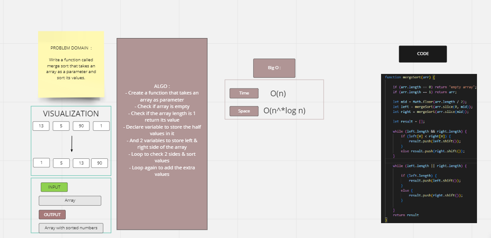

# Challenge Summary
the challenge ased us to Write a function called merge sort that takes an array as a parameter and sort its values.

## Whiteboard Process

## Solution
## Blog :

Pseudo Code

ALGORITHM Mergesort(arr)
    DECLARE n <-- arr.length

    if n > 1
      DECLARE mid <-- n/2
      DECLARE left <-- arr[0...mid]
      DECLARE right <-- arr[mid...n]
      // sort the left side
      Mergesort(left)
      // sort the right side
      Mergesort(right)
      // merge the sorted left and right sides together
      Merge(left, right, arr)

ALGORITHM Merge(left, right, arr)
    DECLARE i <-- 0
    DECLARE j <-- 0
    DECLARE k <-- 0

    while i < left.length && j < right.length
        if left[i] <= right[j]
            arr[k] <-- left[i]
            i <-- i + 1
        else
            arr[k] <-- right[j]
            j <-- j + 1

        k <-- k + 1

    if i = left.length
       set remaining entries in arr to remaining values in right
    else
       set remaining entries in arr to remaining values in left

*********************

    ## input :
    [13,5,90,1]

    step 1 : 
    split the array from middle left and right.
    then we store them in two variables.
    this is repeated until all the elements are split indivdually.

    step2 : 
        sort the left and right sides then merge them together to one sorted array.

        

