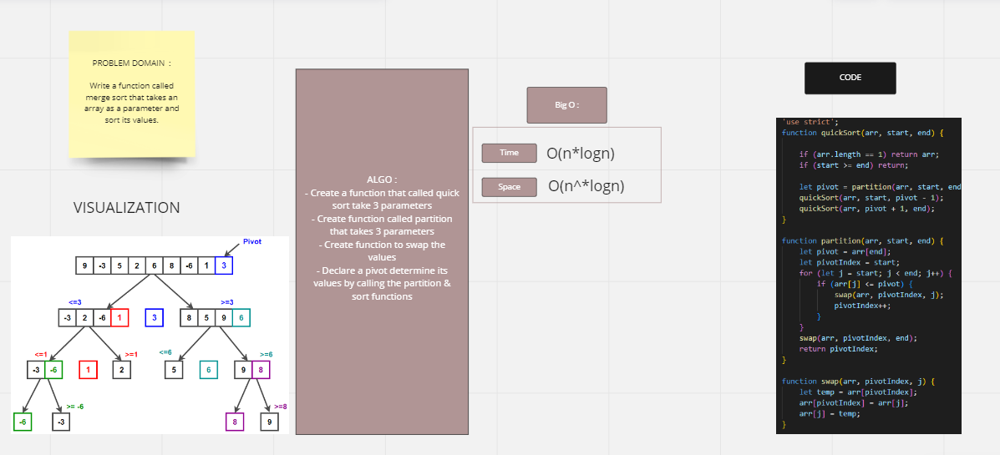
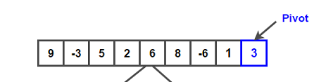
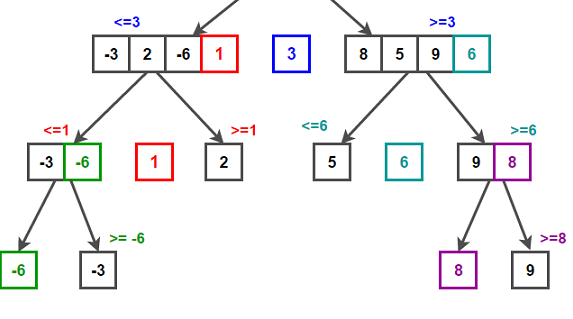

# Challenge Summary
the challenge asked us to Write a function called quick sort  that sorts an array of number

## Whiteboard Process

## Solution
## blog :

Pseudo Code
ALGORITHM QuickSort(arr, left, right)
    if left < right
        // Partition the array by setting the position of the pivot value
        DEFINE position <-- Partition(arr, left, right)
        // Sort the left
        QuickSort(arr, left, position - 1)
        // Sort the right
        QuickSort(arr, position + 1, right)

ALGORITHM Partition(arr, left, right)
    // set a pivot value as a point of reference
    DEFINE pivot <-- arr[right]
    // create a variable to track the largest index of numbers lower than the defined pivot
    DEFINE low <-- left - 1
    for i <- left to right do
        if arr[i] <= pivot
            low++
            Swap(arr, i, low)

     // place the value of the pivot location in the middle.
     // all numbers smaller than the pivot are on the left, larger on the right.
     Swap(arr, right, low + 1)
    // return the pivot index point
     return low + 1

ALGORITHM Swap(arr, i, low)
    DEFINE temp;
    temp <-- arr[i]
    arr[i] <-- arr[low]
    arr[low] <-- temp

    ** input :
    [9,-3,5,2,6,8,-6,1,3]

    - step1: 
choosing the last index to be the poivet

- step2 : 
Now we split the array to 2 parts, smaller and bigger than pivot then now loop through the array and check if the value of the index is less or bigger than the pivot and repeat.

- step3 : 
As the last step, we swap the pivot, which is the last element in our case.
