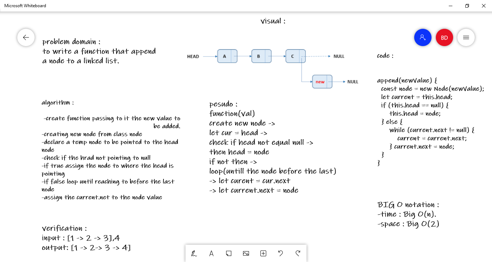
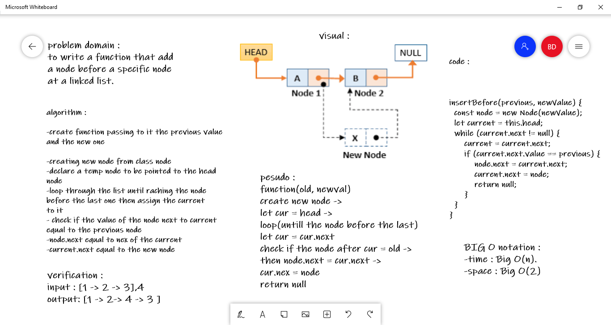
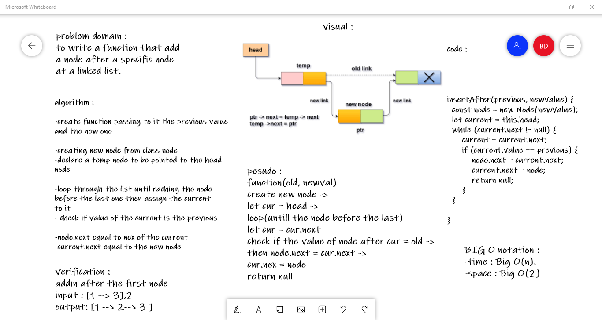
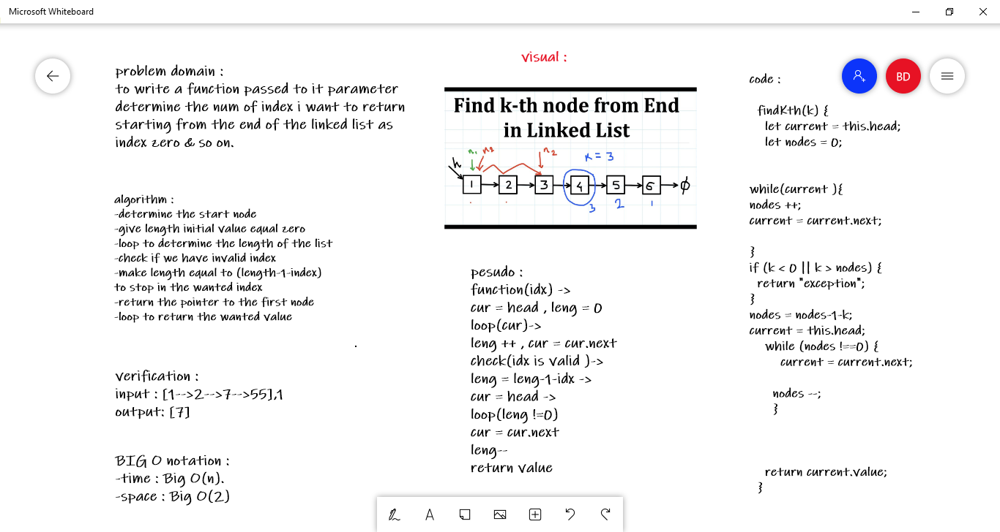

# Challenge Summary
in this challenge we are required to do 3 methods 
1. to append a node to the linked list
2. to add new node pefore a specific node
3. to add node after a specific node

## Whiteboard Process
<!-- Embedded whiteboard image -->

## Approach & Efficiency
## append:

## insert before :

## insert after :

## Kth code :

## Solution
<!-- Show how to run your code, and examples of it in action -->
