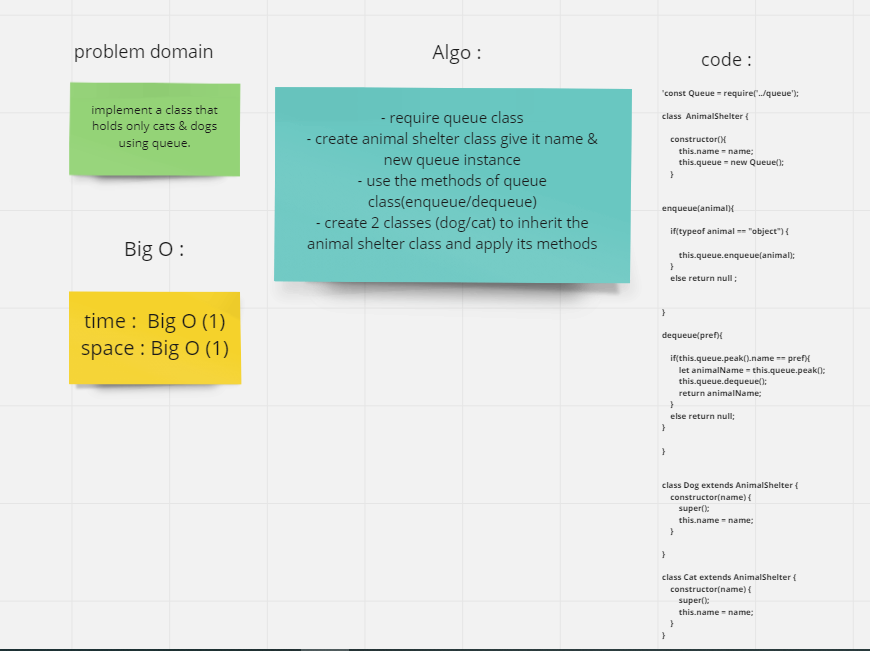

# Challenge Summary
creating a class called animal shelter having only dogs & cats and implement it using (first-in-first-out) approach.

## Whiteboard Process

## Approach & Efficiency
enqueue BigO(1)
dequeue BigO(1)

## Solution
animalShelter.js
