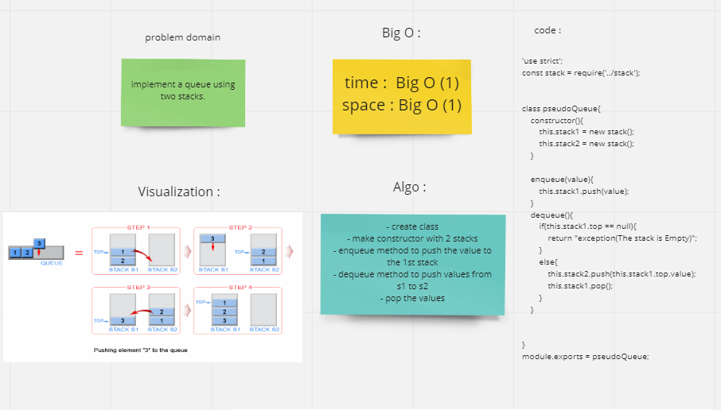

# Challenge Summary
The challange asked us to add (push, pop, peak, isEmpty) For the Stack class and (enqueue, dequeue, peak, isEmpty) For the Queue.

## Whiteboard Process

## Approach & Efficiency
Stack complexity
push(value) space and time complexity of BigO (1) because we don't use any loops and just add to the top of the stack

pop() space and time complexity of BigO (1) because we don't use any loops and just delete the top of the stack

peak() space and time complexity of BigO (1) because we just return the top value of the stack

isEmpty() space and time complexity of BigO (1) because we just check if there is a top and return a boolean

Queue complexity
enqueue(value) space and time complexity of BigO (1) because we don't use any loops and just add to the front of the queue

dequeue() space and time complexity of BigO (1) because we don't use any loops and just delete the first node of the queue

peak() space and time complexity of BigO (1) because we just return the first value of the queue

isEmpty() space and time complexity of BigO (1) because we just check if there is a front and return a boolean

## Solution
pesudo-stack-queue.js