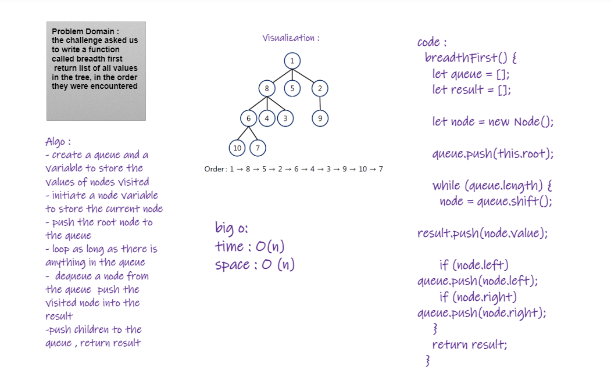

# Challenge Summary
Problem Domain : 
the challenge asked us to write a function called breadth first that
 returns a list of all values in the tree, in the order they were encountered

## Whiteboard Process

## Approach & Efficiency
while loop
time / space complexity : O(n)

## Solution
trees.js
