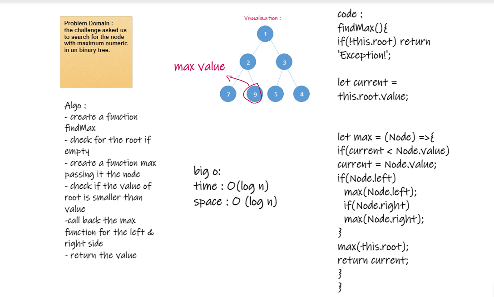

# Challenge Summary

the challenge asked us to search for the node with maximum numeric in an binary tree.

## Whiteboard Process

## Approach & Efficiency
I go with recursion in solving this challenge 
complexty : O(log n)

## Solution
binary-tree.js